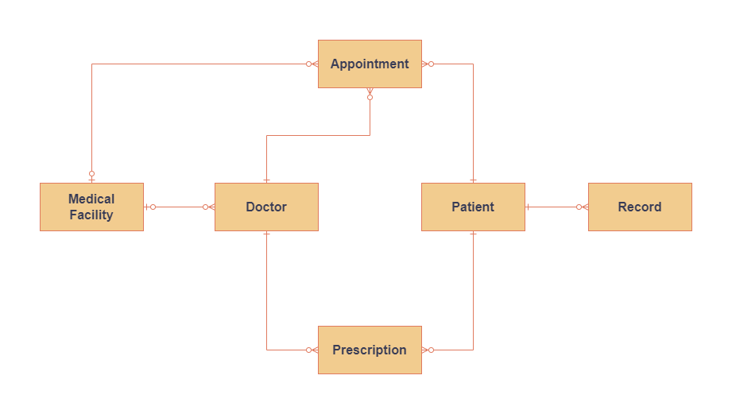
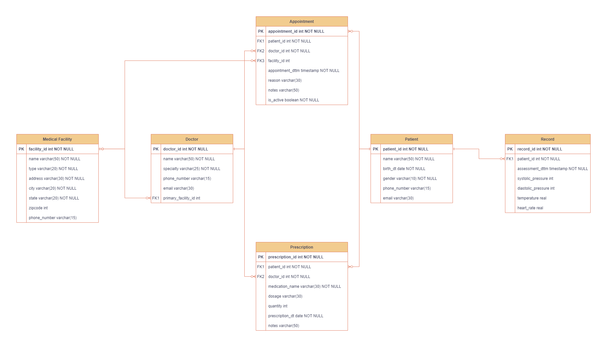

# Andryushenko Solomon, Databases Course Project

## 1. Сущности
1. Patient (пациент)
2. Doctor (врач)
3. Medical Facility (медицинское учереждение, больница, клиника)
4. Appointment (встреча с врачом по записи)
5. Prescription (рецепт от врача)
6. Record (запись состояния пациента, показатели)

## Проектирование базы данных
### 2. Концептуальная модель

### 3. Логическая модель

Данные отношения находятся в *2НФ*, так как они находятся во *1НФ* и каждый не ключевой атрибут неприводимо зависит от любого потенциального ключа.
Разберём подробнее возможные потенциальные ключи для каждой таблицы:
1. `patient` - только `patient_id`. `phone_number`, `email` не подходят, так как могут быть `NULL`.
2. `doctor` - только `doctor_id`.
3. `medical_facility` - `facility_id` и (`state`, `city`, `address`).
4. `appointment` - только `appointment_id`. (`patient_id`, `appointment_dttm`, `is_active`) и (`doctor_id`, `appointment_dttm`, `is_active`) не подходят, так как `is_active` может быть `false`.
5. `prescription` - `prescription_id` и (`patient_id`, `medication_name`, `prescription_dt`).
6. `record` - `record_id` и (`patient_id`, `assessment_dttm`).

Таблица `record` будет версионной, ведь состояние пациента изменяется с течением времени. `SCD` (*Slowly changing dimensions*) будет типа $2$, то есть мы будем добавлять новые записи состояний пациентов в нашу таблицу не изменяя при этом старые записи.

### 4. Физическая модель
**Patient:**
| Название | Описание | Тип данных | Ограничение |
| --------------- | --------------- | --------------- | --------------- |
| `patient_id`    | Идентификатор | INTEGER | PRIMARY KEY |
| `name`    | ФИО | VARCHAR(50) | NOT NULL |
| `birth_dt`    | Дата рождения | DATE | NOT NULL |
| `gender` | Пол | VARCHAR(10) | NOT NULL |
| `phone_number`    | Телефон | VARCHAR(15) |  |
| `email`    | Email-адрес | VARCHAR(30) |  |

**Doctor:**
| Название | Описание | Тип данных | Ограничение |
| --------------- | --------------- | --------------- | --------------- |
| `doctor_id`    | Идентификатор | INTEGER | PRIMARY KEY |
| `name`    | ФИО | VARCHAR(50) | NOT NULL |
| `specialty`    | Специальность | VARCHAR(25) | NOT NULL |
| `phone_number`    | Телефон | VARCHAR(15) |  |
| `email`    | Email-адрес | VARCHAR(30) |  |
| `primary_facility_id` | Базовое мед. учреждение | INTEGER | FOREIGN KEY REFERENCES medical_facility(facility_id) |

**Medical Facility:**
| Название | Описание | Тип данных | Ограничение |
| --------------- | --------------- | --------------- | --------------- |
| `facility_id`    | Идентификатор | INTEGER | PRIMARY KEY |
| `name`    | Название | VARCHAR(50) | NOT NULL |
| `type`    | Тип | VARCHAR(20) | NOT NULL |
| `address` | Адрес (улица, здание) | VARCHAR(30) | NOT NULL |
| `city`    | Город (населённый пункт) | VARCHAR(20) | NOT NULL |
| `state`    | Штат (регион) | VARCHAR(20) | NOT NULL |
| `zipcode`    | Почтовый индекс | INTEGER |  |
| `phone_number`    | Контактный телефон | VARCHAR(15) |  |

**Appointment:**
| Название | Описание | Тип данных | Ограничение |
| --------------- | --------------- | --------------- | --------------- |
| `appointment_id`    | Идентификатор | INTEGER | PRIMARY KEY |
| `patient_id`    | Пациент | INTEGER | FOREIGN KEY REFERENCES patient(patient_id) |
| `doctor_id`    | Доктор | INTEGER | FOREIGN KEY REFERENCES doctor(doctor_id) |
| `facility_id` | Учреждение, где происходит встреча | INTEGER | FOREIGN KEY REFERENCES medical_facility(facility_id) |
| `appointment_dttm`    | Дата и время встречи | TIMESTAMP | NOT NULL |
| `reason`    | Причина встречи | VARCHAR(30) | |
| `notes`    | Замечания | VARCHAR(50) |  |
| `is_active`    | В силе ли встреча? | BOOLEAN | NOT NULL |

**Prescription:**
| Название | Описание | Тип данных | Ограничение |
| --------------- | --------------- | --------------- | --------------- |
| `prescription_id`    | Идентификатор | INTEGER | PRIMARY KEY |
| `patient_id`    | Пациент | INTEGER | FOREIGN KEY REFERENCES patient(patient_id) |
| `doctor_id`    | Доктор | INTEGER | FOREIGN KEY REFERENCES doctor(doctor_id) |
| `medication_name`    | Выписанное лекарство | VARCHAR(30) | NOT NULL |
| `dosage`    | Дозировка | VARCHAR(30) | |
| `quantity`    | Количество препаратов | INTEGER | |
| `prescription_dt`    | Дата рецепта | DATE | NOT NULL |
| `notes`    | Замечания | VARCHAR(50) | |

**Record:**
| Название | Описание | Тип данных | Ограничение |
| --------------- | --------------- | --------------- | --------------- |
| `record_id`    | Идентификатор | INTEGER | PRIMARY KEY |
| `patient_id`    | Пациент | INTEGER | FOREIGN KEY REFERENCES patient(patient_id) |
| `assessment_dttm`    | Дата и время измерений | TIMESTAMP | NOT NULL |
| `systolic_pressure`    | Cистолическое давление | INTEGER | |
| `diastolic_pressure`    | Диастолическое давление | INTEGER | |
| `temperature`    | Температура | REAL | |
| `heart_rate`    | Пульс | REAL | |

### 5-7:
[Ссылка на выполненные задания 5-7](src/main/README.md)